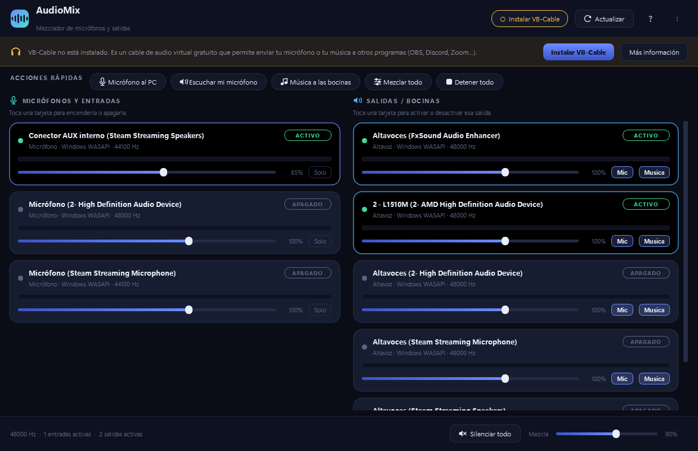
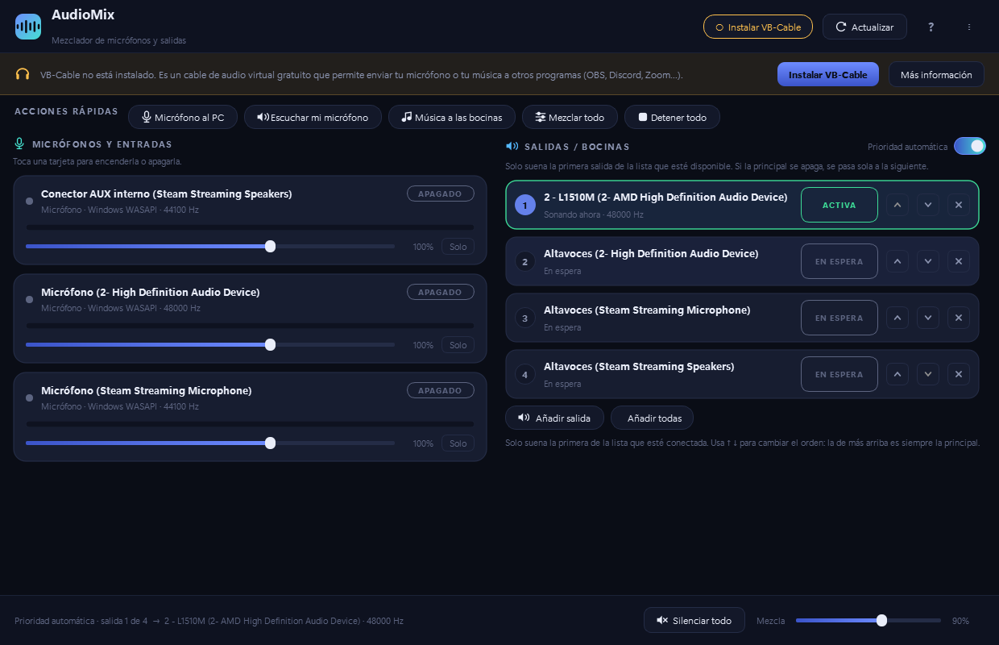

# 🎛️ AudioMix

**Mezclador de audio sencillo y moderno para Windows**, con integración automática
de **VB-Cable** (VB-Audio Virtual Cable).

Enciende y apaga micrófonos con un solo toque, elige por dónde suena todo y
manda tu voz a Discord, OBS, Zoom o cualquier juego… sin pelear con menús
complicados.



---

## ✨ Qué hace

| Función | Detalle |
|---|---|
| 🎤 **Micrófonos y entradas** | Detecta **todas** las entradas del PC. Un clic en la tarjeta la **enciende**, otro clic la **apaga**. |
| 🔊 **Salidas / bocinas** | Elige una o **varias salidas a la vez**. Cada una con su volumen, su vúmetro y su botón de encendido. |
| 🎧 **Prioridad automática** | Ordena tus salidas y deja que AudioMix elija: suena la primera disponible y **cambia sola** a la siguiente cuando la principal se apaga. Pensado para **bocinas Bluetooth**. [Ver más](#-prioridad-automática-de-salidas-bluetooth) |
| 🎚️ **Mezcla** | Volumen independiente por dispositivo + una **mezcla maestra** general. Ondas suavizadas: nunca hay clics al encender o apagar. |
| 🎵 **Música del sistema** | Manda lo que suena en el PC al cable virtual y de ahí a donde quieras. |
| 🔌 **Detección en caliente** | Enciende una bocina Bluetooth y aparece sola en la lista, **sin cortar el audio** que esté sonando. |
| 🎧 **VB-Cable en un clic** | Si no está instalado, AudioMix lo **busca, lo descarga de la web oficial y lo instala** por ti. |
| ⚡ **Acciones rápidas** | «Micrófono al PC», «Escuchar mi micrófono», «Música a las bocinas», «Mezclar todo» y «Detener todo». |
| 🔇 **Silenciar todo** | Corta todo el sonido sin perder la configuración de qué estaba encendido. |
| 💾 **Recuerda tus ajustes** | Al cerrar guarda qué dispositivos estaban activos, sus volúmenes, el orden de prioridad y el tamaño de la ventana. |

---

## 🖥️ Pensado para **cualquier PC**

AudioMix no tiene nada escrito a mano sobre tarjetas ni altavoces concretos:

* **Detecta el hardware al arrancar** y se adapta a lo que haya: integrada,
  USB, HDMI, Bluetooth, auriculares, tarjetas profesionales, etc.
* **Funciona con nombres en cualquier idioma.** El cable virtual se reconoce por
  patrón (`CABLE Input`, `CABLE-A Input`, `CABLE Output`, `VB-Audio`,
  `VoiceMeeter`, `Hi-Fi Cable`…), no por un texto fijo.
* **Elige el mejor controlador** de Windows automáticamente (WASAPI y, si no hay
  nada, DirectSound o MME). Los dispositivos «comodín» tipo *Sound Mapper* o
  *Controlador primario* se descartan solos.
* **Se adapta a la frecuencia de muestreo**: usa 48 kHz o 44,1 kHz según lo que
  admitan tus salidas, y **remuestrea las entradas** que van a otra frecuencia,
  así que puedes mezclar un micro de 44,1 kHz con unos auriculares de 48 kHz.
* **Aguanta mono, estéreo y multicanal** (se queda con los dos primeros canales).
* **Sobrevive a los imprevistos**: si un dispositivo no se puede abrir, se marca
  con un aviso y el resto sigue funcionando. Si lo desconectas, la tarjeta se
  retira sola; al reconectarlo y pulsar *Actualizar*, vuelve con sus ajustes.
* **Windows x64 y ARM64**: elige el controlador de VB-Cable adecuado a la
  arquitectura y a la versión de Windows.
* **Python 3.9 a 3.14** (64 bits).

La única excepción real es el **procesador**: numpy 2.x exige **SSE4.2**, así
que en un AMD Phenom / Athlon II (o Intel anterior a Nehalem) hace falta
Python 3.12 con numpy 1.26 — `reparar.bat` lo detecta y lo instala solo.

---

## 🚀 Cómo se usa

### 1. Arrancar

Doble clic en **`run.bat`**.

La primera vez comprueba si falta algo y **instala las dependencias solo**
(necesita Internet esa única vez). Después abre la ventana sin consola.

`run.bat` busca entre **todos** los Python instalados y se queda con el primero
que funcione **y que ya tenga las dependencias**. Así no falla aunque tengas
varios Python, un gestor de versiones o Python en una carpeta con espacios
(como `C:\Program Files\...`), que es la causa más habitual de que el lanzador
dé un error que en realidad no tiene nada que ver con Internet.

> **¿Algo no arranca?** Doble clic en **`reparar.bat`**. Comprueba cuál de las
> tres dependencias falla de verdad, la reinstala a la fuerza y, si sigue sin
> cargar, revisa el redistribuible de Visual C++ y se ofrece a instalarlo.
>
> Si quieres el detalle antes de tocar nada, **`diagnostico.bat`** genera
> `diagnostico.txt` con todo: qué Pythons hay, cuál se elige, si tienen las
> dependencias, la versión del runtime de Visual C++, si existe `numpy.libs`,
> cuántos dispositivos de audio se detectan y qué recomienda hacer.

> ¿Prefieres la consola para ver mensajes? `python main.py`

### Si sale un error de numpy con «DLL load failed»

Es el fallo más típico en un PC recién preparado, y **no es de AudioMix**:

```
ImportError: DLL load failed while importing _multiarray_umath:
A dynamic link library (DLL) initialization routine failed.
```

Significa que numpy está instalado pero Windows no consigue cargar sus
librerías nativas. Tiene **dos causas posibles**, y `reparar.bat` distingue
cuál es la tuya:

#### Causa A — falta el redistribuible de Microsoft Visual C++ 2015-2022

Ejecuta **`reparar.bat`** y responde **S** cuando pregunte si quieres
descargarlo e instalarlo. Después **reinicia** y prueba otra vez.

Si prefieres hacerlo a mano, el instalador oficial está en
<https://aka.ms/vs/17/release/vc_redist.x64.exe> (en ARM64,
<https://aka.ms/vs/17/release/vc_redist.arm64.exe>).

#### Causa B — el procesador es anterior a SSE4.2

Esta es la que afecta a **AMD Phenom, Athlon II y Phenom II**, y a los Intel
anteriores a Nehalem (2008). El motivo:

* **numpy 1.x** se compilaba con una línea base de **SSE3**.
* **numpy 2.x** subió esa línea base a **SSE4.2**
  ([documentación oficial de NumPy](https://numpy.org/doc/2.5/building/cpu_simd.html)).
* Esos procesadores tienen SSE3 pero **no SSE4.2** (ni SSE4.1 ni SSSE3), así
  que **numpy 2.x no puede cargar nunca** por mucho que lo reinstales.

La solución es usar un Python que admita **numpy 1.26.4** (línea base SSE3):

1. Ejecuta **`reparar.bat`**. Detecta el procesador y te ofrecerá instalar
   **Python 3.12** y las dependencias compatibles.
2. Responde **S**. Se instala **solo para tu usuario**, sin pedir
   administrador y **sin tocar el Python que ya tengas** ni el PATH.
3. Cuando termine, abre **`run.bat`**: encontrará solo el Python que funciona.

Si lo prefieres a mano:

1. Descarga e instala
   [Python 3.12.10](https://www.python.org/ftp/python/3.12.10/python-3.12.10-amd64.exe)
   (marca *Add python.exe to PATH*).
2. En una consola:
   ```bat
   pip install numpy==1.26.4 sounddevice PySide6
   ```
3. Ejecuta `run.bat`.

> La tarjeta gráfica no influye: AudioMix no usa la GPU. Lo que decide es el
> **procesador**. Una GTX 1080 va perfecta; el que se queda corto es el Phenom.

### 2. Encender un micrófono

Toca su tarjeta en la columna **MICRÓFONOS Y ENTRADAS**. Se ilumina, el
vúmetro empieza a moverse y aparece la etiqueta **ACTIVO**. Tócala otra vez y
se apaga.

Ajusta el volumen con el deslizador de la tarjeta. El botón **Solo** hace que
solo se escuche ese micrófono.

### 3. Elegir las bocinas

Toca una o varias tarjetas de **SALIDAS / BOCINAS**. El audio saldrá por todas
las que estén encendidas a la vez.

En cada salida los botones **Mic** y **Música** deciden qué fuentes suenan por
ahí: puedes mandar la música a los altavoces y tu voz solo a los auriculares.

### 4. Acciones rápidas

| Botón | Qué hace |
|---|---|
| **Micrófono al PC** | Enciende los micros y la salida `CABLE Input`. Discord/OBS/Zoom lo verán como `CABLE Output`. |
| **Escuchar mi micrófono** | Enciende los micros y tus altavoces reales (para escucharte). |
| **Música a las bocinas** | Toma el audio del cable virtual y lo manda a tus altavoces. |
| **Mezclar todo** | Enciende todas las entradas y salidas. |
| **Detener todo** | Apaga todo de golpe. |

> Las acciones rápidas eligen las salidas a mano, así que **desactivan la
> prioridad automática** para que siempre veas exactamente lo que hacen.

---

## 🎧 Prioridad automática de salidas (Bluetooth)

Es la función pensada para quien usa **bocinas Bluetooth**: en vez de andar
cambiando la salida a mano cada vez que las enciende o las apaga, le dices a
AudioMix **en qué orden** quieres que suene todo.



Actívala con el interruptor **Prioridad automática** que está encima de las
salidas. Entonces la columna derecha cambia a la **lista ordenada**:

| | |
|---|---|
| **1 · Bocinas Bluetooth** | Es la **principal**. Si están encendidas, suena por ellas. |
| **2 · Altavoces del monitor** | Entra en juego solo si la principal no está disponible. |
| **3 · CABLE Input** | Tercer recurso, y así sucesivamente. |

**Cómo se comporta**

* Solo suena **una** salida: la primera de la lista que esté realmente
  disponible. Las demás quedan *En espera*.
* Si la principal se apaga, se queda sin batería o se desconecta, AudioMix
  **conmuta sola** a la siguiente en un par de segundos.
* Cuando la principal vuelve, **recupera el mando** ella misma.
* Una bocina apagada **no desaparece de la lista**: se queda en su puesto
  marcada como *No disponible*, lista para cuando la enciendas.
* Hay un **margen anti-parpadeo** de 2,5 s entre conmutaciones, para que un
  dispositivo que va y viene no haga saltar el audio sin parar.

**Cómo se ordena**

* **↑ ↓** suben o bajan una salida. **La de más arriba es siempre la principal.**
* **×** la quita de la lista. Las que quites a propósito **no vuelven a añadirse
  solas**.
* **Añadir salida** mete una concreta; **Añadir todas** pone todas las que haya.
* Las salidas nuevas que vayas conectando **se añaden al final** de la lista, así
  que nunca se te queda una fuera. Solo tienes que subirla al puesto que quieras.

**Ejemplo real**

```
1 · Bocinas Bluetooth      ← suenan cuando están encendidas
2 · Altavoces del monitor  ← suenan si las Bluetooth están apagadas
3 · CABLE Input            ← último recurso (para OBS/Discord)
```

Enciendes las Bluetooth → el audio salta a ellas. Las apagas → vuelve solo a los
altavoces del monitor. Las vuelves a encender → regresa a las Bluetooth.

> **Nota sobre Bluetooth:** el cambio de salida tarda un poco (Windows tiene que
> abrir el dispositivo). Es normal ver *Conectando…* durante un segundo o dos.
> Mientras está en la lista de prioridad, su volumen se ajusta por tarjeta
> como cualquier otra salida.

---

## 🎧 VB-Cable: qué es y cómo lo instala AudioMix

**VB-Cable** es un *cable de audio virtual* gratuito de [VB-Audio](https://vb-audio.com/Cable/index.htm).
Funciona como un cable físico:

```
  Tu micrófono  ──►  CABLE Input   ═══(cable)═══   CABLE Output  ──►  Discord / OBS
   (AudioMix)        "altavoces"                     "micrófono"
```

Un extremo (`CABLE Input`) actúa como **altavoces** y el otro (`CABLE Output`)
como **micrófono**. Por eso sirve para inyectar en otras aplicaciones audio que
ellas no podrían capturar por sí solas.

### Cómo lo instala AudioMix

Si al abrir la app no encuentra el cable, verás un **aviso amarillo** en la parte
superior. Al pulsar **«Instalar VB-Cable»**, AudioMix:

1. **Busca la última versión** en `vb-audio.com` (y si la página cambia, usa
   direcciones de respaldo).
2. **Descarga** el paquete oficial (por ejemplo `VBCABLE_Driver_Pack45.zip`, ~1,3 MB).
3. **Lo descomprime** en `%LOCALAPPDATA%\AudioMix\vbcable`.
4. **Elige el controlador correcto** para tu Windows y tu arquitectura
   (`vbMmeCable64_win10.inf` en Windows 10/11 x64, la variante ARM64 o las
   versiones antiguas para Windows 7/8).
5. **Pide permisos de administrador** (UAC) y prueba una instalación silenciosa.
6. Si Windows no expone el cable, **abre el instalador oficial de VB-Audio**:
   solo hay que pulsar **«Install Driver»** en esa ventana.
7. **Comprueba** que los dispositivos aparecen y refresca la lista.

> **Nota importante:** instalar un controlador **siempre** requiere tu
> consentimiento — Windows mostrará un aviso de administrador y, en el peor
> caso, tendrás que pulsar un botón en la ventana de VB-Audio. AudioMix no
> instala nada a tus espaldas.
>
> El controlador es gratuito para uso personal. AudioMix solo lo descarga desde
> la web oficial de su autor. Más información y licencia:
> <https://vb-audio.com/Cable/index.htm>

### Alternativa manual

Si lo prefieres, descárgalo e instálalo tú desde
<https://vb-audio.com/Cable/index.htm> y después pulsa **🔄 Actualizar** en
AudioMix. El aviso amarillo desaparecerá solo.

---

## 🔧 Problemas frecuentes

| Síntoma | Solución |
|---|---|
| **«No se pudieron instalar las dependencias»** | No suele ser Internet. Ejecuta **`reparar.bat`**: averigua qué dependencia falla de verdad, la reinstala a la fuerza y, si es numpy con un error de DLL, instala el redistribuible de Visual C++. |
| **`DLL load failed while importing _multiarray_umath`** | Dos causas: falta el redistribuible de Visual C++ 2015-2022, **o** el procesador no tiene SSE4.2 (Phenom / Athlon II). Ejecuta **`reparar.bat`**: distingue los dos casos y lo arregla. [Detalle](#si-sale-un-error-de-numpy-con-dll-load-failed) |
| **No aparece un dispositivo que acabo de enchufar** | Pulsa **🔄 Actualizar**. Si sigue sin salir: **⋮ → Reiniciar motor y recargar dispositivos**. |
| **Un dispositivo no aparece nunca** | Abre **⋮ → Mostrar todos los controladores**. A veces el mismo altavoz aparece varias veces (WASAPI, DirectSound, MME); el modo normal enseña solo el mejor. |
| **«Algunos dispositivos no se pudieron abrir»** | Casi siempre significa que otra aplicación lo tiene en exclusiva. Cierra esa app y pulsa Actualizar. |
| **El sonido se entrecorta** | Usa WASAPI (es lo que AudioMix elige por defecto), evita «mejoras de audio» de terceros y no pongas 6 dispositivos a la vez. |
| **Se oye un pitido o acople** | Estás enviando el micrófono a los mismos altavoces que lo reproducen. Apaga esa salida o baja la mezcla. |
| **La prioridad no cambia a la bocina Bluetooth** | Comprueba que esté **en la lista** (si la quitaste con **×** no vuelve sola: añádela con *Añadir salida*). Y que aparezca como *Conectada*, no como *No disponible*. |
| **La prioridad salta entre dos salidas sin parar** | Alguna está fallando al abrirse de forma intermitente. Quítala de la lista con **×** o revisa el dispositivo en Windows. |
| **No oigo nada** | Comprueba que haya al menos una **salida** encendida. Si usas prioridad automática, mira el aviso de abajo: si dice que ninguna está disponible, enciende una bocina o añade otra salida. |
| **La instalación de VB-Cable se queda parada** | Es el aviso de administrador de Windows esperando detrás de la ventana, o el instalador de VB-Audio pidiendo que pulses «Install Driver». Busca esa ventana. |
| **Quiero desinstalar VB-Cable** | Panel de control → Programas → *VB-Audio Virtual Cable* → Desinstalar. O ejecuta `%LOCALAPPDATA%\AudioMix\vbcable\VBCABLE_Setup_x64.exe` y pulsa *Remove Driver*. |

Los errores inesperados se guardan en `%APPDATA%\AudioMix\error.log`
(accesible desde **⋮ → Abrir carpeta de configuración**).

---

## 🗂️ Estructura del proyecto

```
AudioMix/
├── run.bat                  Lanzador: busca el mejor Python y abre la app
├── reparar.bat              Repara dependencias que no cargan
├── diagnostico.bat          Genera diagnostico.txt si algo no arranca
├── main.py                  Punto de entrada
├── requirements.txt         PySide6, sounddevice, numpy
├── herramientas/
│   ├── _buscar_python.bat   Localiza un Python válido (lo usan los tres .bat)
│   └── salud.py             Diagnóstico y reparación (informe + reinstalación)
├── audiomix/
│   ├── engine.py            Motor de mezcla en tiempo real (anillos, remuestreo, ganancias)
│   ├── devices.py           Detección y clasificación de dispositivos de audio
│   ├── vbcable.py           Detección, descarga e instalación de VB-Cable
│   ├── main_window.py       Ventana principal
│   ├── widgets.py           Tarjetas, interruptores animados, vúmetros, lista de prioridad
│   ├── icons.py             Iconos vectoriales dibujados con QPainter
│   ├── theme.py             Paleta y hoja de estilos
│   ├── install_dialog.py    Asistente de instalación paso a paso
│   └── config.py            Guardado de ajustes (%APPDATA%\AudioMix\config.json)
├── tests/
│   └── test_core.py         Pruebas del núcleo (anillos, remuestreo, motor, prioridad)
└── tools/
    ├── captura_ui.py        Renderiza la ventana a un PNG (para revisar el diseño)
    └── humo_ui.py           Prueba de humo que recorre toda la interfaz
```
### Cómo está hecho por dentro

* **Cada entrada** tiene su propio `InputStream` que escribe en un *anillo*
  (`RingBuffer`) a la frecuencia maestra.
* **Cada salida** tiene su propio `OutputStream`; en su callback lee de los
  anillos con un **cursor independiente**, así varias salidas pueden sonar la
  misma mezcla sin pisarse.
* Las **ganancias se interpolan** dentro del bloque, de modo que encender,
  apagar o mover un volumen no produce clics.
* Un **limitador de saturación suave** evita que la mezcla distorsione al juntar
  varias fuentes.
* Un **hilo trabajador** abre y cierra los dispositivos: la ventana nunca se
  congela, ni siquiera al abrir una tarjeta de sonido lenta.
* Se usan **bloques del tamaño que decida el controlador** (`blocksize=0`) y
  `auto_convert` de WASAPI, que es lo que hace que funcione con prácticamente
  cualquier tarjeta del mercado.
* El **modo prioridad** lo resuelve el propio motor: en cada ciclo elige la
  primera salida de la lista que esté disponible y fuerza el resto a apagado,
  sin tocar los ajustes manuales (al desactivarlo vuelve todo como estaba).
  Una salida que falla al abrirse se marca con un enfriamiento, así que una
  bocina apagada se salta sola y se reintenta a los pocos segundos.
* La **detección en caliente** usa `PaWasapi_UpdateDeviceList()` de PortAudio,
  que reenumera los dispositivos **sin reiniciar el motor**: se puede enchufar
  una bocina Bluetooth con música sonando y no se corta ni un bloque. La
  comparación se hace por *huella* (nombre + canales + controlador), que cuesta
  ~0,1 ms, cada 2,5 segundos.

---

## 🧪 Desarrollo

```bat
python tests\test_core.py     :: pruebas del núcleo (audio real + conmutación de prioridad)
python tools\humo_ui.py       :: recorre toda la interfaz sin pantalla
python tools\captura_ui.py salida.png --acciones    :: captura de la interfaz
python tools\captura_ui.py salida.png --prioridad   :: captura de la lista de prioridad
```

Las pruebas de audio abren los dispositivos predeterminados unos segundos con la
mezcla puesta a cero, así que **no se oye nada**.

---

## 📋 Requisitos

* **Windows 10 u 11** (64 bits, x64 o ARM64). En Windows 7/8 harían falta
  versiones antiguas de Python y PySide6, que ya no se mantienen.
* **Procesador con SSE4.2** (cualquier Intel desde Nehalem 2008 y cualquier AMD
  desde Bulldozer 2011). En procesadores más antiguos —**AMD Phenom, Athlon II,
  Phenom II**— hay que usar Python 3.12 con numpy 1.26; `reparar.bat` lo
  detecta y lo instala solo. [Ver detalle](#causa-b--el-procesador-es-anterior-a-sse42)
* **Python 3.9 o superior** — con la casilla *«Add python.exe to PATH»* marcada.
  Descarga: <https://www.python.org/downloads/windows/>
* Conexión a Internet **solo la primera vez** (para PySide6, sounddevice, numpy
  y, si lo quieres, el controlador de VB-Cable).

No hace falta ser administrador para usar AudioMix. Solo se piden permisos
cuando decides instalar el controlador de VB-Cable.

---

## 📜 Aviso legal

AudioMix es una utilidad independiente y **no está afiliada a VB-Audio**.
*VB-Cable* y *VoiceMeeter* son marcas de Vincent Burel / VB-Audio. AudioMix se
limita a descargar el paquete oficial desde su web cuando tú se lo pides.

---

## ⚖️ Licencia

```
AudioMix — mezclador de audio para Windows
Copyright (C) 2026 Serch

Este programa es software libre: puedes redistribuirlo y/o modificarlo
bajo los términos de la Licencia Pública General de GNU, tal y como la
publica la Free Software Foundation, en su versión 3 o cualquier versión
posterior.

Este programa se distribuye con la esperanza de que sea útil, pero SIN
NINGUNA GARANTÍA, ni siquiera la garantía implícita de COMERCIABILIDAD o
IDONEIDAD PARA UN PROPÓSITO PARTICULAR. Consulta la Licencia Pública
General de GNU para más detalles.

Deberías haber recibido una copia de la Licencia Pública General de GNU
junto con este programa. Si no es así, consúltala en
<https://www.gnu.org/licenses/>.
```

El texto completo está en el archivo [LICENSE](LICENSE).
